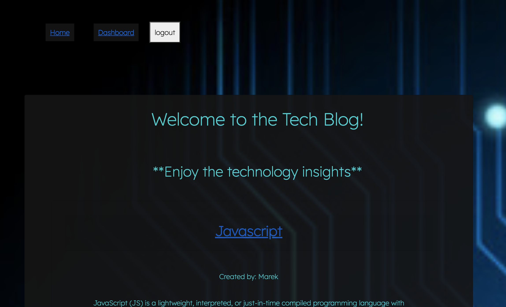

# TECH BLOG
## 


## Table of Contents:
<ol>
<li><a href="#description">Description</a></li>
<li><a href="#installation">Installation</a></li>
<li><a href="#usage">Usage</a></li>
<li><a href="#testing">Testing</a></li>
<li><a href="#contributing">Contributing</a></li>
<li><a href="#questions">Questions</a></li>
<li><a href="#license">License</a></li>
</ol>

## Description:
Tasked with creating a Tech Blog website that users can interface with that makes it easy for the user to view and interact with information stored in a blog website. I was challenged with architecting  and building a website where developers can publish their blog posts and comment on other developers’ posts as well.  I was to use the MVC paradigm in the architectural structure, while utilizing handlebars as the HTML templating language, with Sequelize as the ORM and the express-session npm package for authentication.

## Installation :
The application can be run via the heroku app link provided.  
It can also be accessed locally, by running it in your terminal.   
In order to run locally, use the following command to run the installation packages:
```bash
npm i
```
Then use this to seed the information:
```bash
node seeds/seed.js
```
The application is invoked by using the following command:
```bash
node server.js
```

The application is also connected with a mySQL workbench, where there are three interrelated tables that are stored with users, blogs, and comments as the tables.  The database is called techblog_db.  Using the seed data will populate some previously created users and blogs.    

## Usage: 
The user will open the command terminal inside the chosen coding platform.  The user will then run node server.js inside the command line.   The terminal then connects to the localhost:3001 url.   Otherwise use the heroku.app link for this application at:


The user can:
<ul> 
<li>View Homepage/Blogs</li>
<li>Login or Signup</li>
<li>View all of their blogs(dashboard)</li>
<li>Delete their own blogs</li>
<li>View other Blogs</li>
<li>View other bloggers comments on a blog</li>
<li>Leave comments on other blogs</li>
<li>Logout</li>
</ul>
<br>

## Here is the Heroku App:

## Here is the Github:

### This is the site in action:


<br>
<br>

### Here is a picture of the homepage:




## Testing:
N/A

## Contributing

Pull requests are always welcome.  When contributing to this repository, please first discuss the change you wish to make via email or issue.  
After approval, please follow the "fork-and-pull" Git workflow.
<ol>
<li>Fork the repo on GitHub</li>
<li>Clone the project to your own machine</li>
<li>Commit changes to your own branch</li>
<li>Push your work back up to your fork</li>
<li>Submit a Pull request so that we can review your changes</li>
</ol>

## Questions :

If you have any questions, feel free to reach out to me.   My email is ckhilpisch@gmail.com.

## License :

MIT License
Informataion avaiable here: 
https://opensource.org/licenses/MIT